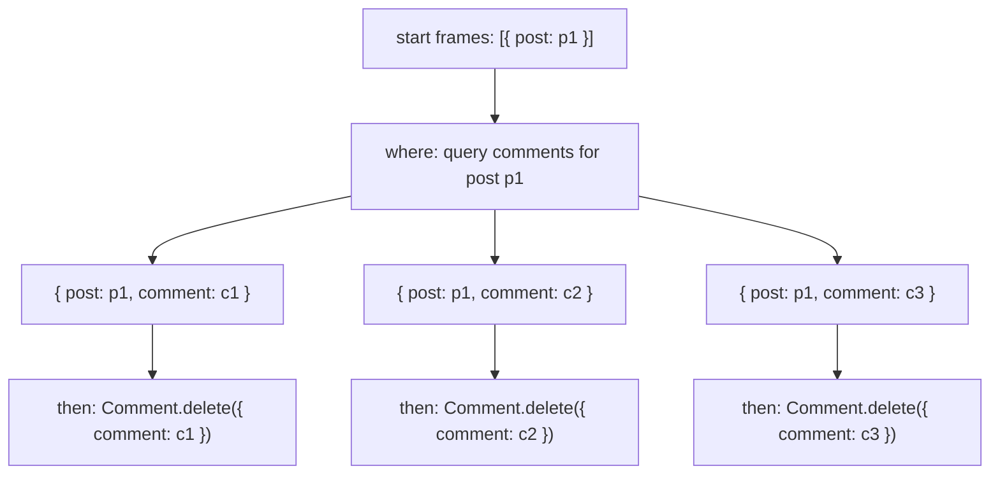

# Implementing Synchronizations

The implementation of synchronizations is an almost direct mapping between the synchronization specifications and a very lightweight TypeScript DSL that allows each synchronization to be declared independently. To include them as part of your application, simply write them using a file name of `filename.sync.ts`, and store them anywhere under `src/syncs/` where you may have any number of directories and nesting. 

## Imports

At the top of each `filename.sync.ts` file, you can use the simplified imports `@concepts` and `@engine`:

```typescript
// These two help you declare synchronizations
import { actions, Sync } from "@engine";
// Choose whatever concepts you have
import { Button, Counter, Notification } from "@concepts";
```

If you have an error in importing your concepts, don't forget to run `deno run build` to automatically prepare the `@concepts` import that will scan your `src/concepts/` directory for your concepts and generate the proper imports.

## Example

Synchronization code maps directly from their specifications. This synchronization

```sync
when
	Button.clicked (kind: "increment_counter) : ()
then
	Counter.increment ()
```

can be represented in TypeScript as:

```typescript
// Each sync is a function that returns a synchronization record
export const ButtonIncrement: Sync = ({}) => ({
    when: actions(
        [Button.clicked, { kind: "increment_counter" }, {}],
    ),
    then: actions(
        [Counter.increment, {}],
    ),
});
```

Each synchronization is a simple function, exported as a const, that returns an record with the appropriate keys, minimally containing `when` and `then`. The `actions` helper function enables a shorthand specification of action patterns as an array, where the first argument is the concept action, the second the input pattern, and in the case of the `when` clause, the third is the output pattern.

Synchronizations may additionally have a `where` clause and specify variables. Suppose we had a synchronization involving a query on state:

```sync
when
	Button.clicked (kind: "increment_counter", user) : ()
	Counter.increment () : ()
where
	in Counter: count > 10
then
	Notification.notify ( message: "Reached 10", to: user)
```

Notice that we now have two variables: `user` and `count`. The `user` variable did not show up previously in the partial match for `Button.clicked` because we did not care who clicked the button, but in this case we'd like to know in order to have someone to send the notification `to`. In addition, we see that we have a `where` clause, in which we have a query looking for the `count`. The implementation is:

```typescript
// Each sync can declare variables by destructuring in the function input
export const NotifyWhenReachTen: Sync = ({ count, user }) => ({
    when: actions(
        [Button.clicked, { kind: "increment_counter", user }, {}],
        [Counter.increment, {}, {}],
    ),
    where: async (frames) => {
        frames = await frames.query(Counter._getCount, {}, { count })
        return frames.filter(($) => $[count] >= 10);
    },
    then: actions(
        [Notification.notify, { message: "Reached 10", to: user }],
    ),
});
```

Each synchronization function actually receives a special object that you can destructure arbitrarily to receive variables to use in your patterns: in this case, specifying `{ count, user }` gives us these two variables in the body of the function to use.

The `where` clause is itself also a function that simply takes in a set of `Frames` and returns a set of `Frames`. This refers to the idea that each `Frame` is a `Record<symbol, unknown>` describing the current bindings of the current frame, where each `Frame` that makes it through to the `then` clause corresponds 1-to-1 with calling all actions in the `then` with those bindings. 

To understand what is going on step-by-step, suppose a `user = "xavier"` clicks on the button, and the count is 11. Read through the comments below to follow along what the value of `frames` is at each point.

```typescript
// Suppose we a `user` = "xavier" clicks the button, when `count` = 11
export const NotifyWhenReachTen: Sync = ({ count, user }) => ({
    when: actions(
        [Button.clicked, { kind: "increment_counter", user }, {}],
        // `user` is now bound to "xavier"
        [Counter.increment, {}, {}],
    ),
    where: async (frames) => {
	    // frames = [{ [user]: "xavier" }]
        frames = await frames.query(Counter._getCount, {}, { count })
        // frames = [{ [user]: "xavier", [count]: 11 }]
        return frames.filter(($) => $[count] >= 10);
        // no change, filter keeps it because count > 10
        // frames = [{ [user]: "xavier", [count]: 11 }]
    },
    then: actions(
        [Notification.notify, { message: "Reached 10", to: user }],
        // we have just one frame, so we fire:
        // Notification.notify { message: "Reached 10", to: "xavier" }
    ),
});
```

If our `count` was less than 10, the `filter` would have reduced `frames = []`, meaning that there would be no actions fired in the `then`. In this way, we are able to declaratively query on arbitrary concept state, as well as fire any number of actions afterward.

**Important:** the syntax `$[count] >= 10` refers to two things:
1. We typically use `$` as a shorthand to refer to the current frame or set of bindings.
2. `count` is a **symbol**, and therefore we do not write `$.count` and instead use `$[count]`

## Working with Frames

`Frames` is simply a small extension of the `Array` class, and all of the standard methods and iterator functions can be applied to it as we have seen (`map`, `filter`, etc.) We have also seen the one additional function, the `.query` method, which enables query functions on concepts to receive certain inputs and produce outputs that enrich the frame. In this basic `where` clause it enhances every frame with a `count` binding. In a slightly more advanced example, something like:

```
frames.query(Comment._getByTarget, { target: post }, { comment })
```

says to lookup the `post` binding for the frame, and query the `Comment` concept for all comments associated with a `target` of that `post`. 

These input/output pattern records match what you expect from the concept specifications. In this case, we have:

```concept
concept Comment [Target]
...
queries
	_getByTarget ( target: Target ): ( comment: Comment )
```

The input pattern, `{ target: post }` says to query with the `target` specified as whatever we have bound in the current set of frames to the variable `post`. The output pattern `{ comment }` leverages JavaScript's shorthand syntax, and really means `{ comment: comment }`, and says to take whatever the query outputs as `comment`, and bind it back into the frames as the `comment` variable.

To see this in action, consider the following synchronization:

```sync
when
	Requesting.request (path: "posts/delete", post) : (request)
	Post.delete (post) : (post)
where
	in Comment: comment has target of post
then
	Comment.delete (comment)
```

with the implementation

```typescript
// Delete all comments for a post when the post is removed
export const PostCommentDeletion: Sync = ({ post, comment, request }) => ({
	when: actions(
	    [Requesting.request, { path: "/posts/delete", post }, { request }],
	    [Post.delete, { post }, { post }],
	),
	where: async (frames) => {
		return await frames
			.query(Comment._getByTarget, { target: post }, { comment }),
	},
	then: actions(
		[Comment.delete, { comment }]
	),
});
```

The interesting aspect of this case is that this notion of frames gives us iteration for free. `Comment._getByTarget` is a query and thus always returns an **array** of potential matches, and each results in a new frame. To visualize this, consider a post p1 with comments c1, c2, and c3 having p1 as their target. When p1 is deleted, the `frames` in the `where` clause evolves as:



## Multiple When Clauses: Handling Request Flow

Some of the previous examples demonstrated **multiple actions in the when clause**. What does this mean? Consider a basic set of synchronizations for the included `LikertSurvey` concept in this repository:

```sync
sync AddQuestionRequest
when
    Requesting.request (path: "/LikertSurvey/addQuestion", survey, text): (request)
then
    LikertSurvey.addQuestion (survey, text)

sync AddQuestionResponse
when
    Requesting.request (path: "/LikertSurvey/addQuestion") : (request)
    LikertSurvey.addQuestion () : (question)
then
    Requesting.respond (request, question)

sync AddQuestionResponseError
when
    Requesting.request (path: "/LikertSurvey/addQuestion") : (request)
    LikertSurvey.addQuestion () : (error)
then
    Requesting.respond (request, error)
```

with the implementation:

```typescript
export const AddQuestionRequest: Sync = ({ request, survey, text }) => ({
  when: actions([
    Requesting.request,
    { path: "/LikertSurvey/addQuestion", survey, text },
    { request },
  ]),
  then: actions([LikertSurvey.addQuestion, { survey, text }]),
});

export const AddQuestionResponse: Sync = ({ request, question }) => ({
  when: actions(
    [Requesting.request, { path: "/LikertSurvey/addQuestion" }, { request }],
    [LikertSurvey.addQuestion, {}, { question }],
  ),
  then: actions([Requesting.respond, { request, question }]),
});

export const AddQuestionResponseError: Sync = ({ request, question }) => ({
  when: actions(
    [Requesting.request, { path: "/LikertSurvey/addQuestion" }, { request }],
    [LikertSurvey.addQuestion, {}, { error }],
  ),
  then: actions([Requesting.respond, { request, error }]),
});
```

In the response synchronization, we match on the idea that there was some `Requesting.request` in the history of the same **flow**, which gives us the proper binding for `request` to `Requesting.respond` to. The semantics of the engine preserves **flow** as any set of actions that have direct causal relation (i.e. they directly caused one another through syncs), and therefore this will match any `Requesting.request` that led to the `LikertSurvey.addQuestion`. In other words, this allows us to very cleanly and declarative say that "when a request for addQuestion occurs, and the actual LikertSurvey.addQuestion action completes with a return of `question`, respond to the same request with `question`."

## Pattern Matching 

Notice in the previous example how we can *omit* whatever parameters we do not care about! For example, in the response synchronization, we do not care about the inputs to `LikertSurvey.addQuestion`, and can completely omit the input pattern. The matching occurs only on a need-basis, and simply matches the keys of whatever pattern we give it.

On the other hand, pattern matching must minimally match all the keys described. For example, if you tried to do some sort of response that matches all possibilities, it fails:

```sync
// INCORRECT
sync AddQuestionResponse
when 
  Requesting.request (path: "/LikertSurvey/addQuestion") : (request)
  LikertSurvey.addQuestion () : (question, error)
then
  Requesting.response (request, question, error)

// CORRECT: the previous split into two syncs
sync AddQuestionResponse
...
sync AddQuestionResponseError
...
```

This is because we're not destructuring the output of `LikertSurvey.addQuestion` into either `(question, error)`, but rather matching on *both values*. This will never occur, because the presence of `error` is explicitly mutually exclusive with `question` in the specification, and in general the usage of `error` represents such a pattern so that this pattern matching can single-out the error case.

### Lining Up Parameters

Remember that the patterns for parameters can be aliased, and that the left-hand side is always the **parameter**, while the right-hand side is always the **variable**. When no colon appears, the shorthand is that *both the parameter and the variable have the same name*. For example, the concept action:

```concept
actions
  LikertSurvey.createSurvey (author, title, scaleMin, scaleMax) : (survey)
```

has an `author` parameter. In practice, we might have a `user` variable instead, meaning that we could have a `then` clause like:

```sync
...
where
  in Sessioning: user is logged in
then
  LikertSurvey.createSurvey (author: user, title, scaleMin, scaleMax)
```

The code pattern for the then would be `[LikertSurvey.createSurvey, { author: user, title, scaleMin, scaleMax }]` as TypeScript uses the same shorthand. 

**Debugging:** ALWAYS CHECK that your patterns match your concept specifications! When synchronizations don't fire, the highest probability of error lies with an incorrect pattern looking for a parameter that doesn't exist on a concept action.

## Where Clause Details and Responses

**Important:** `Requesting.respond` takes a *flat* list of returns, meaning that the specification should never have nested brackets in either *when* or *then* clauses. For example, consider the following:

```sync
// INCORRECT
Requesting.respond (request, { status: "confirmed" })

// CORRECT
Requesting.respond (request, status: "confirmed")
```

If you need to formulate a more complex object, you can specify that in the `where` clause, for example as JSON:

```sync
where
    in User: _getUsername(user) gets username
    body is { "name": username }
then
    Requesting.respond ( request, body )
```

In addition, you should generally treat the `.query` method as an async call. For example, consider the following synchronization:

```typescript
export const GetActiveUserPurchaseTotals: Sync = (
  { request, user, username, total, results },
) => ({
  when: actions(
    [Requesting.request, { path: "/purchase-totals" }, { request }],
  ),
  where: async (frames) => {
    frames = await frames.query(User._getActiveUsers, {}, { user });
    frames = await frames.query(User._getUsername, { user }, { username });
    frames = await frames.query(Purchasing._getTotalForUser, { user }, { total });
    return frames.collectAs([user, username, total], results);
  },
  then: actions(
    [Requesting.respond, { request, results }],
  ),
});
```

Notice how each call to `.query` is properly awaited. This additionally allows any logging for debugging. In general, the `where` clause should endeavor to keep the bindings in each frame, and understand that whatever final filtering/reducing is done, that the set of all `then` clauses will fire once per output frame from the `where` clause.

### collectAs

The final line of the `where` clause from the previous example has an additional helper method part of the `Frames` type, `collectAs`, which helps collect multiple values across frames into a single frame or a smaller set of frames. The first argument is the `collect` argument, an array of variables, and the second is the `as` argument, a different variable. This function "collects" all the declared variables together as an array of records (with JSON string keys), and then groups by the rest of the non-collected variables (usually ending up with just one output frame), finally associating the collected array "as" the specified variable. For example, consider the following set of frames:

```typescript
const frames1 = new Frames(
  { [name]: "Alice", [age]: 30, [city]: "NYC" },
  { [name]: "Bob", [age]: 25, [city]: "NYC" },
  { [name]: "Charlie", [age]: 35, [city]: "LA" },
  { [name]: "Diana", [age]: 28, [city]: "LA" },
);

const result1 = frames1.collectAs([name, age], scores);
console.log("Result:", result1);
```

This results in:
```
Result: Frames(2) [
  {
    [Symbol(city)]: "NYC",
    [Symbol(scores)]: [ { name: "Alice", age: 30 }, { name: "Bob", age: 25 } ]
  },
  {
    [Symbol(city)]: "LA",
    [Symbol(scores)]: [ { name: "Charlie", age: 35 }, { name: "Diana", age: 28 } ]
  }
]
```

Notice how non-collected variables (like `city`) are intact and their uniqueness determines the number of frames, whereas all the collected variables have been collected as `scores`. This pattern is particularly useful when you'd like to group a set of results as a body, such as in:

```typescript
({
//...
  where: {
    //...
    return frames.collectAs([user, username, total], results);
  },
  then: actions(
    [Requesting.respond, { request, results }],
  ),
});
```

which, for a sample output, results in the following JSON response on the server:

```json
{
    "results": [
        {
            "user": "019a2e14-14cb-7a4e-959c-6c4ed485322d",
            "username": "Charlie",
            "total": 60
        },
        {
            "user": "019a2e14-14f5-71e3-a02f-8ddbee490f62",
            "username": "Dina",
            "total": 0
        },
        {
            "user": "019a2e14-145c-7002-b3b0-0b81669e9185",
            "username": "Alice",
            "total": 42
        }
    ]
}
```

# Common Pitfalls

Synchronizations are in some ways a reflection of the underlying cause-and-effect structure of your application. Here are a few common issues that can occur while programming with synchronizations, especially when you might miss a few edge cases.

## Zero Matches

Usually occurring with a `where` clause in which you are looking for an array or multiple matches, there's the possibility that your queries return no frames at all. What happens then? Since the then occurs for each frame, this means **the synchronization does not fire at all**. In the sample app, ConceptBox, there was initially a synchronization for returning all files that looked like this:

```typescript
export const ListMyFilesRequest: Sync = ({ request, session, user, file, filename, results }) => ({
  when: actions([Requesting.request, { path: "/my-files", session }, { request }]),
  where: async (frames) => {
    frames = await frames.query(Sessioning._getUser, { session }, { user });
    frames = await frames.query(FileUploading._getFilesByOwner, { owner: user }, { file, filename });
    // frames = [] if no files uploaded yet!
    return frames.collectAs([file, filename], results);
  },
  then: actions([Requesting.respond, { request, results }]),
});
```

However, this would always timeout and not respond if there were no files uploaded yet. Instead, a general pattern to fix this is to be explicit about your default return value, as follows:

```typescript
import { actions, Frames, Sync } from "@engine";
import { Requesting, Sessioning, FileUploading, Sharing } from "@concepts";

export const ListMyFilesRequest: Sync = ({ request, session, user, file, filename, results }) => ({
  when: actions([Requesting.request, { path: "/my-files", session }, { request }]),
  where: async (frames) => {
    // Make sure to grab the original frame to return to the response
    const originalFrame = frames[0];
    frames = await frames.query(Sessioning._getUser, { session }, { user });
    frames = await frames.query(FileUploading._getFilesByOwner, { owner: user }, { file, filename });
    // Explicitly check if frames are empty
    if (frames.length === 0) {
      // Then join the original frame with whatever result variables you need
      const response = {...originalFrame, [results]: []}
      // Note the additional import `Frames` available from @engine 
      return new Frames(response)
    }
    return frames.collectAs([file, filename], results);
  },
  then: actions([Requesting.respond, { request, results }]),
});
```

There are only two minor additions:
1. Grabbing the original frame, as the `then` clause needs other bindings.
2. Checking for whatever empty condition you may have, then adding any binding you may need for results.

## Missing actionId in `then` clause

This is an error you may occasionally encounter with malformed synchronizations, particularly in the `where` clause. It occurs primarily for two reasons:

1. Your `where` function is not properly returning a set of Frames. Make sure that the function is labeled as `async`, and that you await each call to `.query`.
2. Your frame is missing other bindings, meaning you manually created a new frame or didn't join with an original frame. See the previous example for a nice pattern to do this when you want to form an entirely new frame.
